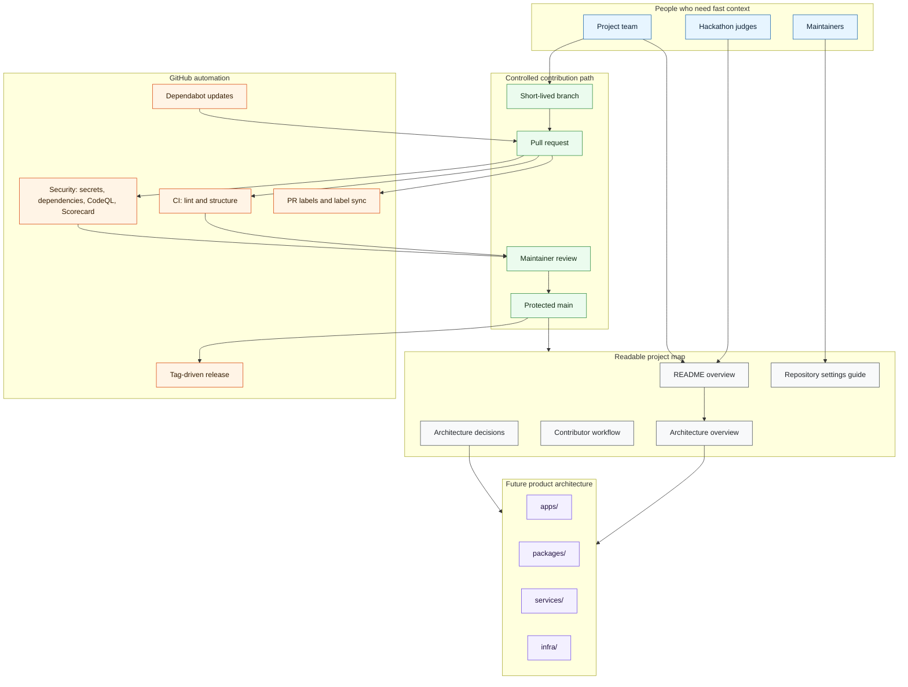

# Juured

[](https://github.com/Juured/Juured/actions/workflows/ci.yml)
[](https://github.com/Juured/Juured/actions/workflows/security.yml)
[](https://github.com/Juured/Juured/actions/workflows/release.yml)


Juured is a Ruum IDE project prepared for nonprofit Estonian hackathon collaboration.

This repository is intentionally bootstrapped before product code is added. The goal is to make the
project easy for judges, team members, and future maintainers to understand while keeping
collaboration, security, and release hygiene in place from the first implementation pull request.

## Repository Status

| Area            | Status                                                     |
| --------------- | ---------------------------------------------------------- |
| Project stage   | Foundation scaffold                                        |
| Visibility      | Internal project repository                                |
| Runtime stack   | Not selected yet                                           |
| CI checks       | Repository lint, formatting, structure validation          |
| Security checks | Secret scanning, dependency review, CodeQL, OSSF Scorecard |
| Release flow    | Semantic tags create GitHub releases                       |

## What Is Included

- GitHub Actions for CI, security scanning, PR labelling, label synchronization, and releases.
- Dependabot configuration for npm and GitHub Actions dependency update pull requests.
- Contributor documentation for branching, pull requests, reviews, releases, and security reporting.
- Mermaid architecture diagrams that render directly in GitHub Markdown.
- Local verification scripts so contributors can run the same checks before opening a pull request.
- Issue templates, PR template, CODEOWNERS, Dependabot, labels, and release-note categories.

## Architecture



See [docs/ARCHITECTURE.md](docs/ARCHITECTURE.md) for the complete foundation architecture.

## GitHub Automation

| File                               | Purpose                                                             |
| ---------------------------------- | ------------------------------------------------------------------- |
| `.github/workflows/ci.yml`         | Runs repository linting, formatting, spelling, and structure checks |
| `.github/workflows/security.yml`   | Runs secret scanning, dependency review, CodeQL, and OSSF Scorecard |
| `.github/workflows/pr-labeler.yml` | Adds area/type labels from changed files                            |
| `.github/workflows/labels.yml`     | Synchronizes the repository label set from `.github/labels.json`    |
| `.github/workflows/release.yml`    | Creates GitHub releases from semantic version tags                  |
| `.github/dependabot.yml`           | Opens update PRs for npm packages and GitHub Actions                |

## Agent Collaboration

This repository includes shared instructions for teammates using Codex, Claude Code, Cursor, or
similar coding agents:

- `AGENTS.md` for repository-wide agent rules.
- `CLAUDE.md` for Claude Code entry-point instructions.
- `.cursor/rules/juured-agent-workflow.mdc` for Cursor agents.
- `docs/AGENT_WORKFLOW.md` for issue-based progress tracking and handoffs.

Agents should use GitHub issues and PRs as the progress log instead of creating separate tracking
systems.

## Quickstart

```bash
npm ci
npm run verify
```

The repository currently validates documentation, workflow files, package metadata, spelling,
formatting, and required structure. Application-specific commands should be added to
`npm run verify` once the product stack is selected.

## Collaborating

Use short-lived branches and pull requests into `main`.

```text
feature/<issue-number>-short-description
fix/<issue-number>-short-description
docs/<issue-number>-short-description
chore/<issue-number>-short-description
```

Before opening a PR:

```bash
npm run verify
```

For the full workflow, see [CONTRIBUTING.md](CONTRIBUTING.md) and
[docs/CONTRIBUTOR_WORKFLOW.md](docs/CONTRIBUTOR_WORKFLOW.md).

## Releases

Releases are tag-driven. Use semantic version tags:

```bash
git tag v0.1.0
git push origin v0.1.0
```

The release workflow creates a GitHub release from the pushed tag and uses GitHub-generated release
notes. See [docs/RELEASE_PROCESS.md](docs/RELEASE_PROCESS.md).

## Security And Visibility

Do not commit secrets, credentials, private keys, production data, or personal data. Report
vulnerabilities using [SECURITY.md](SECURITY.md).

This repository is structured for internal collaboration and judging, not public distribution. Keep
third-party materials, private event data, and team-only implementation details out of public
channels unless the maintainers explicitly approve sharing them.

## Reference

This foundation was inspired by the structure of
[Ker102/nullstate-cli](https://github.com/Ker102/nullstate-cli): clear top-level documentation,
contributor workflow files, GitHub automation, security documentation, architecture docs, and
release hygiene.
