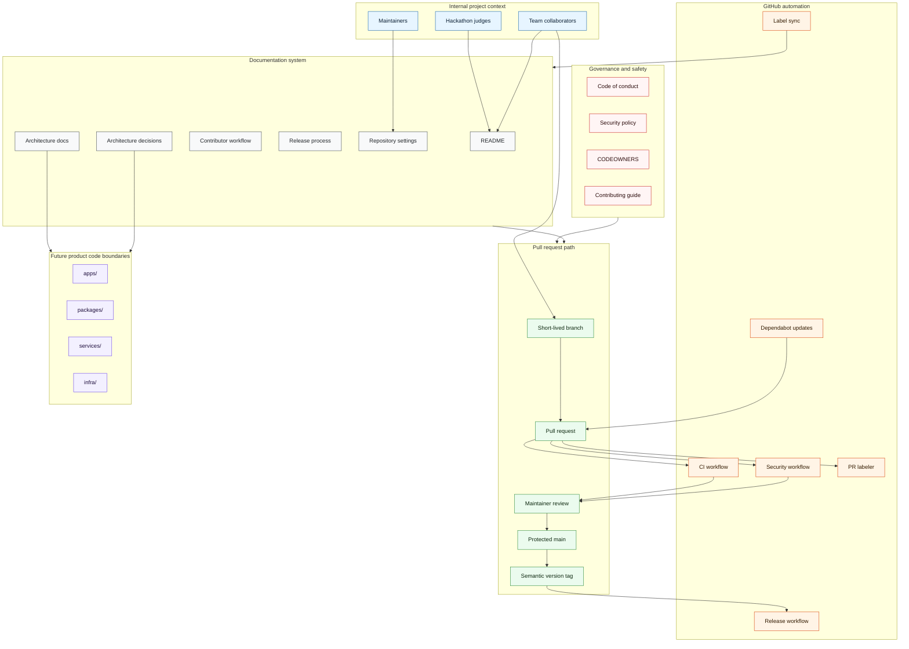

# Architecture

Juured is currently a repository foundation for an internal Ruum IDE hackathon project. Product
architecture should be added only after the application stack and first implementation scope are
selected.

The foundation has two jobs:

- Make the project understandable for judges, collaborators, and maintainers.
- Keep pull requests, security checks, releases, and documentation disciplined from day one.

## Repository Architecture Map

## Architecture Overview

The repository is deliberately split into five visible areas:

| Area               | Purpose                                                             | Primary files                                          |
| ------------------ | ------------------------------------------------------------------- | ------------------------------------------------------ |
| Knowledge          | Help judges and teammates understand the project quickly            | `README.md`, `docs/`                                   |
| Governance         | Define collaboration, ownership, conduct, and security expectations | `CONTRIBUTING.md`, `SECURITY.md`, `.github/CODEOWNERS` |
| Automation         | Keep checks repeatable in PRs and on `main`                         | `.github/workflows/`, `.github/dependabot.yml`         |
| Agent coordination | Keep Codex, Claude Code, Cursor, and teammate handoffs aligned      | `AGENTS.md`, `CLAUDE.md`, `.cursor/rules/`, issues     |
| Local verification | Let contributors run CI-style checks before pushing                 | `package.json`, `scripts/`                             |
| Future product     | Reserved boundaries for real app, service, package, and infra code  | `apps/`, `services/`, `packages/`, `infra/`            |

The product directories are documented but not created yet. That avoids empty placeholder folders
and keeps the first implementation PR responsible for the stack it introduces.

## Intended Source Layout

The repository should stay explicit about ownership and boundaries as product code is added.

| Path        | Purpose                                                        |
| ----------- | -------------------------------------------------------------- |
| `apps/`     | User-facing applications, editors, dashboards, or demos        |
| `packages/` | Shared libraries used by more than one app or service          |
| `services/` | Backend services, workers, or API boundaries                   |
| `infra/`    | Infrastructure as code and deployment manifests                |
| `docs/adr/` | Architecture decision records                                  |
| `.github/`  | GitHub automation, issue templates, labels, and release config |
| `scripts/`  | Local and CI helper scripts                                    |

Do not create these product directories until there is real code to put in them. Empty architecture
folders increase merge conflict surface without adding clarity.

## CI/CD Flow

1. Contributors open a short-lived branch from `main`.
2. Pull requests run repository checks, security checks, dependency review, and labelling.
3. Maintainers review the PR and require passing checks before merge.
4. `main` remains deployable or release-ready.
5. A semantic version tag creates a GitHub release.

## Workflow Inventory

| Workflow/config                    | Trigger                                 | Purpose                                                        |
| ---------------------------------- | --------------------------------------- | -------------------------------------------------------------- |
| `.github/workflows/ci.yml`         | PRs, `main`, manual                     | Repository linting, formatting, spelling, and structure checks |
| `.github/workflows/security.yml`   | PRs, `main`, weekly, manual             | Gitleaks, dependency review, CodeQL, and OSSF Scorecard        |
| `.github/workflows/pr-labeler.yml` | PR opened/synchronized/reopened         | Applies area and type labels from changed files                |
| `.github/workflows/labels.yml`     | Manual or label config change on `main` | Syncs labels from `.github/labels.json`                        |
| `.github/workflows/release.yml`    | Semantic version tags or manual         | Creates a GitHub release with generated notes                  |
| `.github/dependabot.yml`           | Weekly                                  | Opens update PRs for npm and GitHub Actions                    |

## Agent Coordination

AI coding agents must follow the same repository map as human contributors:

- `AGENTS.md` is the shared instruction entry point.
- `CLAUDE.md` forwards Claude Code users to the same rules.
- `.cursor/rules/juured-agent-workflow.mdc` gives Cursor the same constraints.
- `docs/AGENT_WORKFLOW.md` defines issue-based progress tracking and handoff notes.

The repository intentionally uses GitHub issues and pull requests as the progress log. This prevents
multiple agents from editing one shared status file and creating unnecessary merge conflicts.

## Decision Rules

- Add an ADR for architectural choices that affect future contributors.
- Keep shared workflows small and composable.
- Add stack-specific checks only when the stack exists in the repository.
- Keep local verification and CI aligned through `npm run verify`.
